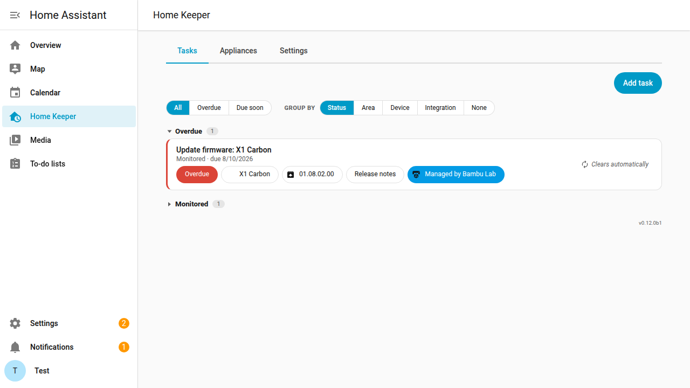
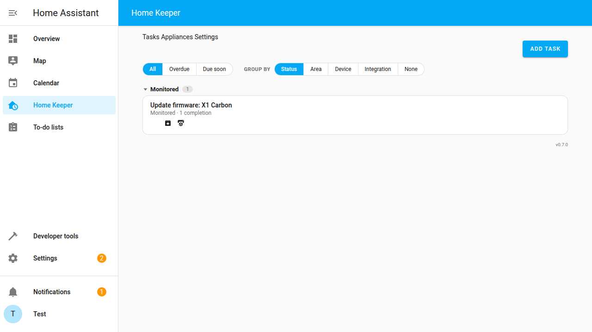
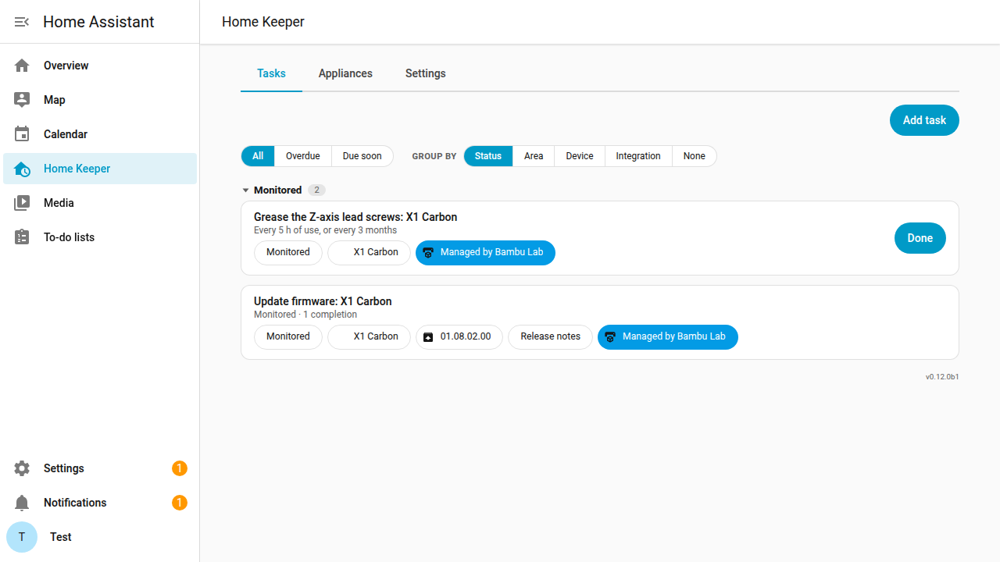
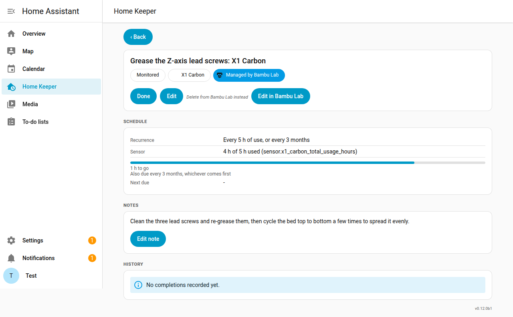

# Home Keeper — Bambu Lab

[![GitHub Release][release-shield]][releases]
[![License][license-shield]](LICENSE)
[![hacs][hacs-shield]][hacs]
![Project Maintenance][maintenance-shield]
[![ko-fi][kofi-shield]][kofi]

A small glue integration that surfaces a [Bambu Lab](https://github.com/greghesp/ha-bambulab)
printer's **firmware updates** as [Home Keeper](https://github.com/prestomation/ha-home-keeper)
tasks — so *"a firmware update is waiting"* shows up in your to-do list, on the printer's
device page, and in the mobile app, right next to everything else you have to keep on top of.

## What it does

- **Firmware update available** → a Home Keeper **"Update firmware: …"** task becomes
  **due now** on the printer's device, with a *"Managed by Bambu Lab"* chip and a chip
  showing the new version (plus a *Release notes* link when Bambu Lab provides one).
- **Firmware installed** → the task clears itself and tucks into Home Keeper's collapsed
  **Monitored** section, recording that the update happened. It comes back the next time
  an update ships.
- **It's a read-only reminder.** You can't check the task off by hand — it's a mirror of
  the printer's state, so it clears *only* when Bambu Lab reports the firmware is up to
  date. Install the update from the Bambu Lab app or the printer's screen and the task
  clears on its own.

> Screenshots are produced by the browser e2e tier driving the real stack
> (`SHOT_DIR=docs/images CAPTURE=1 bash ci/e2e-up.sh`), so they always reflect current
> behaviour.

## Why

Bambu Lab printers nag for firmware updates on the printer itself, but that's easy to miss
if the printer lives in a garage or a print farm. The Bambu Lab integration already exposes
the pending update as a Home Assistant `update` entity — this glue turns that into a first-class
Home Keeper task so it lands in the same to-do list, calendar, and mobile notifications as
the rest of your home maintenance, instead of being a lone entity you have to remember to check.

## How it works

The Bambu Lab integration surfaces firmware availability as one of two entities, depending
on its **Firmware update** option — an **`update` entity** (`update.<printer>_firmware_update`)
when the option is on, or a **`binary_sensor`** with device_class `update`
(`binary_sensor.<printer>_firmware_update`) when it's off (the default). This glue watches
**either** one — both read `on` when an update is available:

| Firmware update entity | What the glue does |
|---|---|
| state `on` (update available) | create the task (born armed) if new, else `home_keeper.trigger_task` to re-arm |
| state `off` (up to date) | `home_keeper.complete_task` (records it, goes dormant) |
| `unavailable` / `unknown` (printer offline) | nothing — the task keeps its state, so an offline printer never records a phantom install |

The task carries `managed_by.completion_blocked`, which is what makes it a **read-only
mirror**: Home Keeper hides the *Done* action, so the only thing that clears it is the
printer reporting up to date.

The glue is **stateless**: it re-derives everything from `home_keeper.list_tasks` (matched
by its `source` namespace) and Bambu Lab's registry entities, and reconciles once on start —
so it self-heals across restarts and never creates duplicate tasks. It also **registers
itself with Home Keeper's companion discovery**, so it shows up as a *connected* companion
under Home Keeper's **Settings → Companions**. Every cross-integration call is
`has_service`-guarded, so nothing breaks if Home Keeper is missing.

## Install

1. Install **Home Keeper** and the **Bambu Lab** integration, and add your printer.
2. Add this repo to HACS as a custom repository (category: Integration), install, restart.
3. Settings → Devices & Services → **Add Integration** → *Home Keeper — Bambu Lab*.

### Options

- **Task name template** — default `Update firmware: {printer_name}`.

## Development & tests

Four tiers (see `ci/`):

- **`ci/test-unit.sh`** — pure decision logic (`logic.py`), no Home Assistant required.
- **`ci/test-integration.sh`** — the glue against Home Keeper's real test fake in a HA runtime.
- **`ci/test-docker.sh`** — full end-to-end (REST): **real** Home Keeper + a fake Bambu Lab
  firmware entity + this glue in a container. `ci/fetch-upstreams.sh` clones the upstreams
  (pin with `HK_REF` / `BAMBU_REF`). This tier also runs the **contract test** that asserts
  the *real* ha-bambulab still exposes the `firmware_update` entity the glue depends on.
- **`ci/e2e-up.sh`** — browser end-to-end: the same stack with the Home Keeper panel built,
  where Playwright asserts/screenshots the real panel. Refresh the images with
  `SHOT_DIR=docs/images CAPTURE=1 bash ci/e2e-up.sh`.

> **Why a fake Bambu Lab in the runtime tiers?** The real integration needs a printer
> (MQTT/cloud) to instantiate its firmware entity, which can't run in CI — so the docker/
> browser tiers stand in a small fake that exposes the same `update` entity on the
> `bambu_lab` platform (toggled via `bambu_lab.set_firmware_available`). The real
> integration's firmware surface is guarded by the static contract test.

## Printer maintenance (optional)

Firmware is a mirror: the printer tells us when an update is waiting. Maintenance has no
such signal, so this is the one place the glue holds an opinion. Turn on **Also create
printer maintenance tasks** in the options and it creates a Home Keeper task per item
per printer, following **Bambu Lab's own published schedule**.

| Item | Interval | On by default |
|---|---|---|
| Clean and oil the Y/Z linear rods | 150 printer hours, or 1 month | yes |
| Grease the Z-axis lead screws | 450 printer hours, or 3 months | yes |
| Replace the activated carbon air filter | 720 printer hours, or 3 months | yes |
| Clean the X-axis carbon rods | 1 month | yes |
| Anti-rust treatment on the Y/Z rods | 3 months | yes |
| Clean the camera lens | 6 months | yes |
| Check and clean the extruder gear | 1 week | no |
| Check and clean the toolhead fans | 1 week | no |

**Why two numbers.** Bambu's guidance is written as a duty cycle, not a date: the X1 wiki
says to change the air filter *"every three months if the printer is used for about 8
hours a day"*, and *"every month"* for a production machine. That is 8 × 90 = 720 printer
hours, so the hours figure and the calendar figure together reproduce the manufacturer's
own rule. Items metered in hours become Home Keeper **usage tasks** bound to the printer's
`sensor.<printer>_total_usage_hours`, with the calendar figure as a backstop, so whichever
lands first wins. Items Bambu schedules by the calendar alone (the carbon rods carry no
lubricant; anti-rust is about humidity) become plain recurring tasks.

Every interval is a **default, not a decree**. Change any of them in the options, or edit
the task itself in Home Keeper: the glue deliberately leaves the sensor binding unlocked,
and Home Keeper keeps the hours you've already accumulated when you retune the target.
Each item can also be switched off individually.

Two caveats worth stating plainly:

- `total_usage_hours` counts **printer usage** hours, not strictly print hours. Close
  enough for a service interval, and it is what Bambu's own guidance is written against.
- **The nozzle and the cutter blade are deliberately absent.** Bambu publishes those
  intervals in *spools of filament* ("check the blade every 3–5 rolls"), and no Home
  Assistant sensor exposes a spool count, so there is no honest conversion. Rather than
  invent a number, the catalog leaves them out. Add your own usage task against the
  hours sensor if you want one.

Unlike the firmware mirror, these tasks are yours to check off: you do the work, so the
**Done** button is live and each completion is recorded in the task's history (which also
restarts both halves of the interval).

Design notes and the sourced interval table: [`docs/MAINTENANCE_CATALOG_PLAN.md`](docs/MAINTENANCE_CATALOG_PLAN.md).

## Design

The full contract this glue uses (the `triggered` task type, `managed_by.completion_blocked`
read-only mirrors, and companion discovery) lives in Home Keeper's
[`docs/INTEGRATING.md`](https://github.com/prestomation/ha-home-keeper/blob/main/docs/INTEGRATING.md)
and [`docs/GLUE_INTEGRATIONS.md`](https://github.com/prestomation/ha-home-keeper/blob/main/docs/GLUE_INTEGRATIONS.md).

<!-- Badge reference links. -->

[releases]: https://github.com/prestomation/ha-home-keeper-bambu-lab/releases
[release-shield]: https://img.shields.io/github/release/prestomation/ha-home-keeper-bambu-lab.svg?style=for-the-badge
[license-shield]: https://img.shields.io/github/license/prestomation/ha-home-keeper-bambu-lab.svg?style=for-the-badge
[hacs-shield]: https://img.shields.io/badge/HACS-Custom-41BDF5.svg?style=for-the-badge
[hacs]: https://github.com/hacs/integration
[maintenance-shield]: https://img.shields.io/badge/maintainer-%40prestomation-blue.svg?style=for-the-badge
[kofi-shield]: https://img.shields.io/badge/Ko--fi-donate-FF5E5B?style=for-the-badge&logo=kofi&logoColor=white
[kofi]: https://ko-fi.com/prestomation
